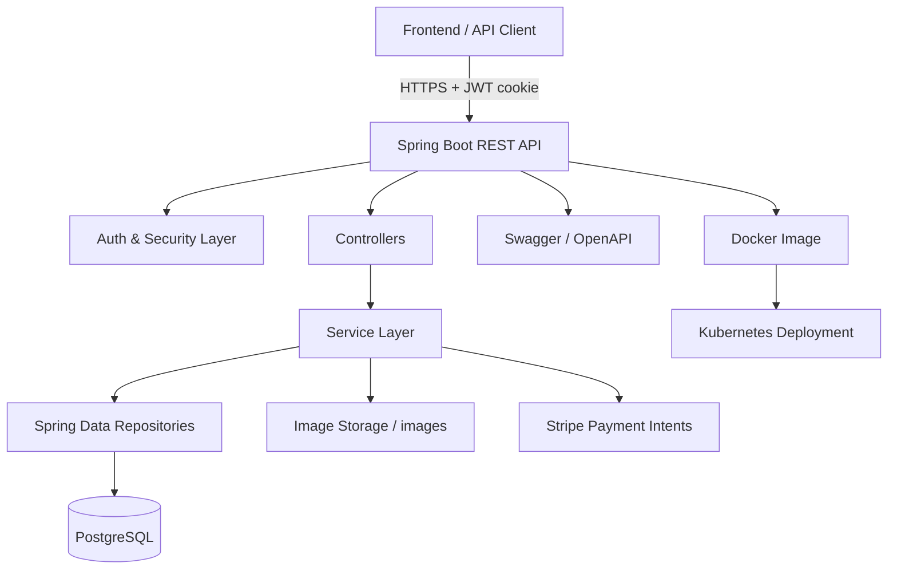

<div align="center">

# 🛒 Sb-Ecom

**A production-ready Spring Boot e-commerce backend** — authentication, catalog, cart, orders, payments, and multi-role access, fully containerized and cluster-ready.

[](.)
[](.)
[](.)
[](.)
[](.)
[](.)

[Live Demo](#-live-demo) · [API Overview](#-api-overview) · [Local Setup](#-local-development) · [Deployment](#-docker--kubernetes)

</div>

---

## 📖 Overview

Sb-Ecom powers a full store workflow — user auth, catalog browsing, cart & order management, address handling, analytics, and Stripe-based payment initialization — behind a clean, layered backend architecture. It ships with Docker and Kubernetes manifests, so it runs the same way locally, in a container, or in a cluster.

## 🔗 Live Demo

| Resource | Link |
|---|---|
| 🌐 Swagger UI | [sb-ecom-latest-yf4p.onrender.com/swagger-ui/index.html](https://sb-ecom-latest-yf4p.onrender.com/swagger-ui/index.html) |
| 📄 OpenAPI JSON | [sb-ecom-latest-yf4p.onrender.com/v3/api-docs](https://sb-ecom-latest-yf4p.onrender.com/v3/api-docs) |

> ⏳ **Note:** Hosted on Render's free tier — the service spins down after inactivity, so the first request may take ~30–50s to wake up.

## 🏗️ Architecture



## ✨ Highlights

- 🔐 JWT-based sign-in/sign-out with secure cookie handling
- 👥 Role-based access — public, user, seller, and admin endpoints
- 📦 Product & category management with pagination, sorting, keyword search
- 🛒 Cart and order workflows with address management
- 💳 Stripe payment intent generation for checkout flows
- 🖼️ Static image serving and upload support
- 📘 Swagger UI with bearer-auth support
- 🐳 Docker and ☸️ Kubernetes manifests included

## 🛠️ Tech Stack

| Layer | Technology |
|---|---|
| Language | Java 21 |
| Framework | Spring Boot 3.5.5 (Web, Data JPA, Security, Validation) |
| Database | PostgreSQL |
| Auth | JWT (JJWT) |
| Payments | Stripe Java SDK |
| Mapping | ModelMapper |
| API Docs | springdoc-openapi |
| Deployment | Docker, Kubernetes |

## 📁 Project Structure

```
src/main/java/EcommerceProject/
├── Controller/      # REST controllers
├── service/         # Business logic
├── repositories/     # Spring Data JPA repositories
├── Model/           # Entities
├── payload/         # DTOs and response models
├── Security/        # JWT, auth, security configuration
└── config/          # Application-wide configuration
src/main/resources/   # App properties, static resources
k8s/                  # Kubernetes manifests
```

## 🧩 Core Modules

<details>
<summary><b>Authentication & User Management</b></summary>

- Register a new account
- Sign in and receive a JWT cookie
- Sign out by clearing the cookie
- Retrieve current username and user details
- List sellers

</details>

<details>
<summary><b>Catalog Management</b></summary>

- Public category and product browsing
- Admin and seller product CRUD operations
- Product image upload
- Keyword search and category filtering

</details>

<details>
<summary><b>Cart & Checkout</b></summary>

- Create or update carts with items
- Add products to cart by quantity
- Update or remove cart items
- Place orders from the authenticated user context
- Generate Stripe client secrets for payment flows

</details>

<details>
<summary><b>Order & Admin Operations</b></summary>

- View all orders as an admin
- View seller-specific orders
- Update order status for admin and seller roles
- View application analytics

</details>

<details>
<summary><b>Address Management</b></summary>

- Create, read, update, and delete addresses
- Fetch addresses for the authenticated user

</details>

## 📡 API Overview

<details>
<summary><b>🔑 Auth</b></summary>

| Method | Endpoint | Notes |
| --- | --- | --- |
| POST | `/api/auth/signup` | Register a new user |
| POST | `/api/auth/signin` | Sign in and set the JWT cookie |
| POST | `/api/auth/signout` | Clear the JWT cookie |
| GET | `/api/auth/username` | Current authenticated username |
| GET | `/api/auth/user` | Current authenticated user details |
| GET | `/api/auth/sellers` | Paginated seller listing |

</details>

<details>
<summary><b>🛍️ Public Catalog</b></summary>

| Method | Endpoint | Notes |
| --- | --- | --- |
| GET | `/api/public/categories` | Paginated category list |
| GET | `/api/public/products` | Paginated product list with keyword/category filters |
| GET | `/api/public/categories/{categoryId}/products` | Products for a category |
| GET | `/api/public/products/keyword/{keyword}` | Keyword search |

</details>

<details>
<summary><b>🛠️ Admin & Seller Catalog</b></summary>

| Method | Endpoint | Notes |
| --- | --- | --- |
| POST | `/api/admin/categories/{categoryId}/product` | Add a product as admin |
| POST | `/api/seller/categories/{categoryId}/product` | Add a product as seller |
| PUT | `/api/admin/products/{productId}` | Update a product as admin |
| PUT | `/api/seller/products/{productId}` | Update a product as seller |
| DELETE | `/api/admin/products/{productId}` | Delete a product as admin |
| DELETE | `/api/seller/products/{productId}` | Delete a product as seller |
| PUT | `/api/admin/products/{productId}/image` | Upload a product image |
| PUT | `/api/seller/products/{productId}/image` | Upload a product image |
| GET | `/api/admin/products` | Paginated admin product list |
| GET | `/api/seller/products` | Paginated seller product list |

</details>

<details>
<summary><b>🏷️ Categories</b></summary>

| Method | Endpoint | Notes |
| --- | --- | --- |
| GET | `/api/public/categories` | Public category listing |
| POST | `/api/admin/categories` | Create category |
| PUT | `/api/admin/categories/{categoryId}` | Update category |
| DELETE | `/api/admin/categories/{categoryId}` | Delete category |

</details>

<details>
<summary><b>🛒 Cart</b></summary>

| Method | Endpoint | Notes |
| --- | --- | --- |
| POST | `/api/cart/create` | Create or update cart with items |
| POST | `/api/carts/products/{productId}/quantity/{quantity}` | Add a product to cart |
| GET | `/api/carts` | List all carts |
| GET | `/api/carts/users/cart` | Get the authenticated user cart |
| PUT | `/api/cart/products/{productId}/quantity/{operation}` | Update cart quantity |
| DELETE | `/api/carts/{cartId}/product/{productId}` | Remove a product from cart |

</details>

<details>
<summary><b>📍 Addresses</b></summary>

| Method | Endpoint | Notes |
| --- | --- | --- |
| POST | `/api/addresses` | Create address for current user |
| GET | `/api/addresses` | List all addresses |
| GET | `/api/addresses/{addressId}` | Get address by ID |
| GET | `/api/users/addresses` | List current user addresses |
| PUT | `/api/addresses/{addressId}` | Update address |
| DELETE | `/api/addresses/{addressId}` | Delete address |

</details>

<details>
<summary><b>📦 Orders, Payments & Analytics</b></summary>

| Method | Endpoint | Notes |
| --- | --- | --- |
| POST | `/api/order/users/payments/{paymentMethod}` | Place an order |
| POST | `/api/order/stripe-client-secret` | Create a Stripe payment intent |
| GET | `/api/admin/orders` | Paginated admin order list |
| GET | `/api/seller/orders` | Paginated seller order list |
| PUT | `/api/admin/orders/{orderId}/status` | Update order status as admin |
| PUT | `/api/seller/orders/{orderId}/status` | Update order status as seller |
| GET | `/api/admin/app/analytics` | Application analytics |

</details>

## 🔒 Security & Access Rules

- `/api/auth/**`, `/api/public/**`, Swagger endpoints, `/images/**`, and CORS preflight requests are public.
- `/api/admin/**` requires the `ADMIN` role.
- `/api/seller/**` requires `ADMIN` or `SELLER` roles.
- JWT is stored in a cookie whose name is configured via `JWT_COOKIE_NAME`.
- CORS allows only the origin defined by `FRONTEND_URL`.

## ⚙️ Environment Variables

| Variable | Purpose |
| --- | --- |
| `SPRING_APPLICATION_NAME` | Spring application name |
| `PORT` | Server port fallback (default `9090`) |
| `DB_URL` | PostgreSQL JDBC URL |
| `DB_USERNAME` | Database username |
| `DB_PASSWORD` | Database password |
| `HIBERNATE_DDL_AUTO` | Hibernate schema strategy |
| `HIBERNATE_DIALECT` | Hibernate dialect |
| `PROJECT_IMAGE_PATH` | Local image storage directory |
| `JWT_SECRET` | Base64-encoded JWT signing secret |
| `JWT_EXPIRATION` | JWT expiration (ms) |
| `JWT_COOKIE_NAME` | Cookie name used for JWT storage |
| `FRONTEND_URL` | Allowed frontend origin for CORS |
| `IMAGE_BASE_URL` | Public base URL for images |
| `STRIPE_SECRET_KEY` | Stripe secret key |

## 🚀 Local Development

### Prerequisites
- Java 21
- Maven 3.9+
- PostgreSQL 14+
- A valid Stripe secret key (optional, for payment intent testing)

### 1. Configure environment variables

```powershell
$env:SPRING_APPLICATION_NAME="Sb-Ecom"
$env:PORT="9090"
$env:DB_URL="jdbc:postgresql://localhost:5432/ecommerce"
$env:DB_USERNAME="postgres"
$env:DB_PASSWORD="postgres"
$env:HIBERNATE_DDL_AUTO="update"
$env:HIBERNATE_DIALECT="org.hibernate.dialect.PostgreSQLDialect"
$env:PROJECT_IMAGE_PATH="images/"
$env:JWT_SECRET="your-base64-secret"
$env:JWT_EXPIRATION="3000000"
$env:JWT_COOKIE_NAME="springBootEcom"
$env:FRONTEND_URL="http://localhost:5173"
$env:IMAGE_BASE_URL="http://localhost:9090/images"
$env:STRIPE_SECRET_KEY="sk_test_your_key"
```

### 2. Start PostgreSQL
Create a database named `ecommerce` matching the credentials above.

### 3. Run the application

```bash
./mvnw spring-boot:run
```
On Windows: `.\mvnw.cmd spring-boot:run`

### 4. Open the API documentation
- Swagger UI: `http://localhost:9090/swagger-ui/index.html`
- OpenAPI JSON: `http://localhost:9090/v3/api-docs`

## 👤 Default Seed Accounts

| Username | Password | Roles |
| --- | --- | --- |
| `user1` | `password1` | `ROLE_USER` |
| `seller1` | `password2` | `ROLE_SELLER` |
| `admin` | `adminPass` | `ROLE_USER`, `ROLE_SELLER`, `ROLE_ADMIN` |

## 🖼️ Images

Uploaded/served images are exposed under `/images/**`. Physical storage location is configured via `PROJECT_IMAGE_PATH` and mapped in `WebMvcConfig`.

## 🐳 Docker & ☸️ Kubernetes

**Docker**
```bash
docker build -t sb-ecom .
docker run -p 9090:9090 --env-file .env sb-ecom
```

**Kubernetes** — the `k8s/` directory contains manifests for the app, PostgreSQL, config maps, and secrets.
```bash
kubectl apply -f k8s/
```

## 📝 Notes

- Stateless JWT auth via Spring Security.
- Product browsing endpoints are paginated and sortable.
- Swagger supports bearer authentication for protected endpoints.
- Ready for local development, containerization, and cluster deployment.

---

<div align="center">
Built with ☕ and Spring Boot
</div>