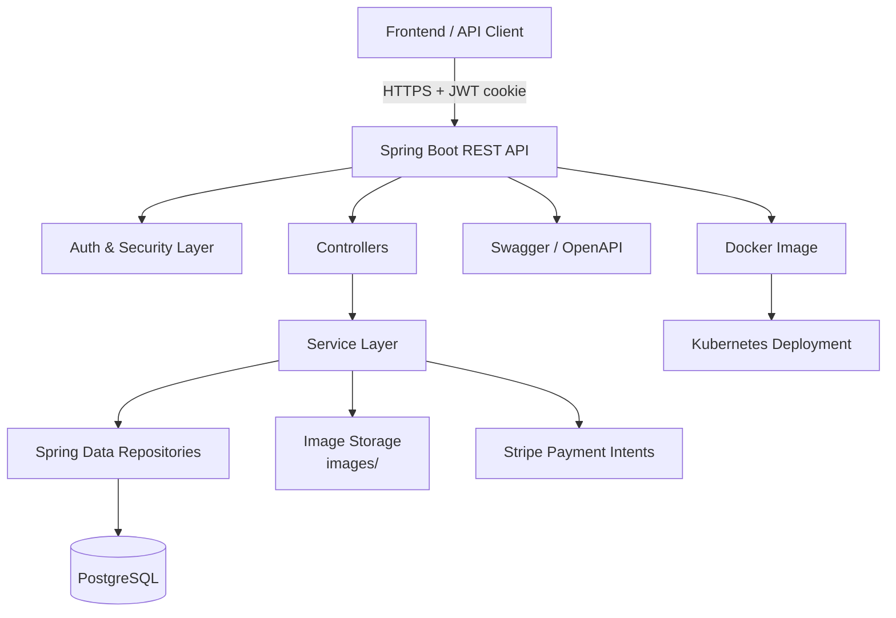

# Sb-Ecom

Sb-Ecom is a Spring Boot 3.5 ecommerce backend for building and running a full store workflow: authentication, catalog browsing, cart and order management, address handling, analytics, and Stripe-based payment initialization.

It combines a layered backend architecture with Docker and Kubernetes deployment support, making it suitable for local development, containerized runs, and cluster deployment.

## Architecture



## Highlights

- JWT-based sign-in and sign-out with secure cookie handling
- Role-based access for public, user, seller, and admin endpoints
- Product and category management with pagination, sorting, and keyword search
- Cart and order workflows with address management
- Stripe payment intent generation for checkout flows
- Static image serving from the local `images/` directory
- Swagger UI with bearer-auth support
- Docker and Kubernetes manifests included

## Tech Stack

- Java 21
- Spring Boot 3.5.5
- Spring Web, Spring Data JPA, Spring Security, Validation
- PostgreSQL
- JWT via JJWT
- ModelMapper
- Stripe Java SDK
- springdoc-openapi

## Project Structure

- `src/main/java/EcommerceProject/Controller` - REST controllers
- `src/main/java/EcommerceProject/service` - business logic
- `src/main/java/EcommerceProject/repositories` - JPA repositories
- `src/main/java/EcommerceProject/Model` - entities
- `src/main/java/EcommerceProject/payload` - DTOs and response models
- `src/main/java/EcommerceProject/Security` - JWT, auth, and security configuration
- `src/main/java/EcommerceProject/config` - application-wide configuration
- `src/main/resources` - application properties and static resources
- `k8s` - Kubernetes manifests

## Core Modules

### Authentication and user management

- Register a new account
- Sign in and receive a JWT cookie
- Sign out by clearing the cookie
- Retrieve the current username and user details
- List sellers

### Catalog management

- Public category and product browsing
- Admin and seller product CRUD operations
- Product image upload
- Keyword search and category filtering

### Cart and checkout

- Create or update carts with items
- Add products to cart by quantity
- Update or remove cart items
- Place orders from the authenticated user context
- Generate Stripe client secrets for payment flows

### Order and admin operations

- View all orders as an admin
- View seller-specific orders
- Update order status for admin and seller roles
- View application analytics

### Address management

- Create, read, update, and delete addresses
- Fetch addresses for the authenticated user

## API Overview

### Auth

| Method | Endpoint | Notes |
| --- | --- | --- |
| POST | `/api/auth/signup` | Register a new user |
| POST | `/api/auth/signin` | Sign in and set the JWT cookie |
| POST | `/api/auth/signout` | Clear the JWT cookie |
| GET | `/api/auth/username` | Current authenticated username |
| GET | `/api/auth/user` | Current authenticated user details |
| GET | `/api/auth/sellers` | Paginated seller listing |

### Public catalog

| Method | Endpoint | Notes |
| --- | --- | --- |
| GET | `/api/public/categories` | Paginated category list |
| GET | `/api/public/products` | Paginated product list with keyword/category filters |
| GET | `/api/public/categories/{categoryId}/products` | Products for a category |
| GET | `/api/public/products/keyword/{keyword}` | Keyword search |

### Admin and seller catalog

| Method | Endpoint | Notes |
| --- | --- | --- |
| POST | `/api/admin/categories/{categoryId}/product` | Add a product as admin |
| POST | `/api/seller/categories/{categoryId}/product` | Add a product as seller |
| PUT | `/api/admin/products/{productId}` | Update a product as admin |
| PUT | `/api/seller/products/{productId}` | Update a product as seller |
| DELETE | `/api/admin/products/{productId}` | Delete a product as admin |
| DELETE | `/api/seller/products/{productId}` | Delete a product as seller |
| PUT | `/api/admin/products/{productId}/image` | Upload a product image |
| PUT | `/api/seller/products/{productId}/image` | Upload a product image |
| GET | `/api/admin/products` | Paginated admin product list |
| GET | `/api/seller/products` | Paginated seller product list |

### Categories

| Method | Endpoint | Notes |
| --- | --- | --- |
| GET | `/api/public/categories` | Public category listing |
| POST | `/api/admin/categories` | Create category |
| PUT | `/api/admin/categories/{categoryId}` | Update category |
| DELETE | `/api/admin/categories/{categoryId}` | Delete category |

### Cart

| Method | Endpoint | Notes |
| --- | --- | --- |
| POST | `/api/cart/create` | Create or update cart with items |
| POST | `/api/carts/products/{productId}/quantity/{quantity}` | Add a product to cart |
| GET | `/api/carts` | List all carts |
| GET | `/api/carts/users/cart` | Get the authenticated user cart |
| PUT | `/api/cart/products/{productId}/quantity/{operation}` | Update cart quantity |
| DELETE | `/api/carts/{cartId}/product/{productId}` | Remove a product from cart |

### Addresses

| Method | Endpoint | Notes |
| --- | --- | --- |
| POST | `/api/addresses` | Create address for current user |
| GET | `/api/addresses` | List all addresses |
| GET | `/api/addresses/{addressId}` | Get address by ID |
| GET | `/api/users/addresses` | List current user addresses |
| PUT | `/api/addresses/{addressId}` | Update address |
| DELETE | `/api/addresses/{addressId}` | Delete address |

### Orders, payments, and analytics

| Method | Endpoint | Notes |
| --- | --- | --- |
| POST | `/api/order/users/payments/{paymentMethod}` | Place an order |
| POST | `/api/order/stripe-client-secret` | Create a Stripe payment intent |
| GET | `/api/admin/orders` | Paginated admin order list |
| GET | `/api/seller/orders` | Paginated seller order list |
| PUT | `/api/admin/orders/{orderId}/status` | Update order status as admin |
| PUT | `/api/seller/orders/{orderId}/status` | Update order status as seller |
| GET | `/api/admin/app/analytics` | Application analytics |

## Security and Access Rules

- `/api/auth/**`, `/api/public/**`, Swagger endpoints, `/images/**`, and CORS preflight requests are public.
- `/api/admin/**` requires the `ADMIN` role.
- `/api/seller/**` requires `ADMIN` or `SELLER` roles.
- JWT is stored in a cookie whose name is configured through `JWT_COOKIE_NAME`.
- CORS is configured to allow the frontend origin defined by `FRONTEND_URL`.

## Environment Variables

The application reads configuration from environment variables and does not hardcode database or secret values.

| Variable | Purpose |
| --- | --- |
| `SPRING_APPLICATION_NAME` | Spring application name |
| `PORT` | Server port fallback, defaults to `9090` |
| `DB_URL` | PostgreSQL JDBC URL |
| `DB_USERNAME` | Database username |
| `DB_PASSWORD` | Database password |
| `HIBERNATE_DDL_AUTO` | Hibernate schema strategy |
| `HIBERNATE_DIALECT` | Hibernate dialect |
| `PROJECT_IMAGE_PATH` | Local image storage directory |
| `JWT_SECRET` | Base64-encoded JWT signing secret |
| `JWT_EXPIRATION` | JWT expiration in milliseconds |
| `JWT_COOKIE_NAME` | Cookie name used for JWT storage |
| `FRONTEND_URL` | Allowed frontend origin for CORS |
| `IMAGE_BASE_URL` | Public base URL for images |
| `STRIPE_SECRET_KEY` | Stripe secret key |

## Local Development

### Prerequisites

- Java 21
- Maven 3.9+
- PostgreSQL 14+
- A valid Stripe secret key if you want to exercise payment intent creation

### 1. Configure environment variables

Set the variables above in your shell, IDE run configuration, or a `.env` file consumed by your local process manager.

Example PowerShell session:

```powershell
$env:SPRING_APPLICATION_NAME="Sb-Ecom"
$env:PORT="9090"
$env:DB_URL="jdbc:postgresql://localhost:5432/ecommerce"
$env:DB_USERNAME="postgres"
$env:DB_PASSWORD="postgres"
$env:HIBERNATE_DDL_AUTO="update"
$env:HIBERNATE_DIALECT="org.hibernate.dialect.PostgreSQLDialect"
$env:PROJECT_IMAGE_PATH="images/"
$env:JWT_SECRET="your-base64-secret"
$env:JWT_EXPIRATION="3000000"
$env:JWT_COOKIE_NAME="springBootEcom"
$env:FRONTEND_URL="http://localhost:5173"
$env:IMAGE_BASE_URL="http://localhost:9090/images"
$env:STRIPE_SECRET_KEY="sk_test_your_key"
```

### 2. Start PostgreSQL

Create a database named `ecommerce` and make sure the credentials match the environment variables.

### 3. Run the application

```bash
./mvnw spring-boot:run
```

On Windows, you can also use:

```powershell
.\mvnw.cmd spring-boot:run
```

### 4. Open the API documentation

- Swagger UI: `http://localhost:9090/swagger-ui/index.html`
- OpenAPI JSON: `http://localhost:9090/v3/api-docs`

## Default Seed Accounts

The security configuration seeds demo users on startup if they do not already exist.

| Username | Password | Roles |
| --- | --- | --- |
| `user1` | `password1` | `ROLE_USER` |
| `seller1` | `password2` | `ROLE_SELLER` |
| `admin` | `adminPass` | `ROLE_USER`, `ROLE_SELLER`, `ROLE_ADMIN` |

## Images

- Uploaded or served images are exposed under `/images/**`.
- The physical storage location is configured by `PROJECT_IMAGE_PATH` and mapped in `WebMvcConfig`.

## Docker

Build the image:

```bash
docker build -t sb-ecom .
```

Run the container:

```bash
docker run -p 9090:9090 --env-file .env sb-ecom
```

## Kubernetes

The `k8s/` directory contains manifests for the application, PostgreSQL, config maps, and secrets. The app deployment expects the same environment variables described above to be provided through `ConfigMap` and `Secret` resources.

Typical workflow:

```bash
kubectl apply -f k8s/
```

## Notes

- The project uses Spring Security with stateless JWT auth.
- Product browsing endpoints are paginated and sortable.
- Swagger supports bearer authentication for protected endpoints.
- The repository is ready for local development, containerization, and cluster deployment.

